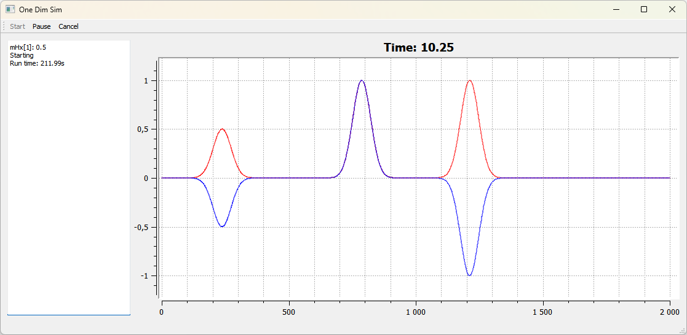
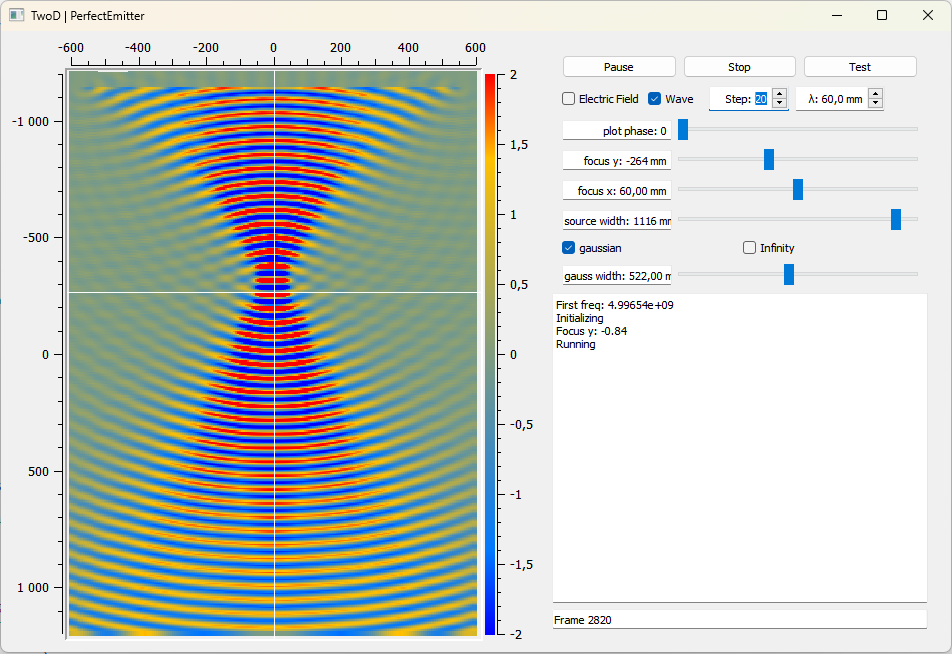

## Introduction 

Finite Difference Time Domain (FDTD) is a numerical analysis technique where Maxwell's equations are discretized in both time and space as a computational grid. By solving Maxwell’s equations in a step-wise manner, FDTD allows for the simulation of the electromagnetic wave propagation through various media.

This repo showcases a study of FDTD method that I developed in Qt 5 for Photonics course of my Master's degree in Physics Engineering, at the Faculty of Sciences of 
Univeristy of Lisbon, back in 2016.

The work is based off of the lectures of [EMPossible](https://www.youtube.com/watch?v=KHTByojnsZE&list=PLLYQF5WvJdJWoU9uEeWJ6-MRzDSziNnGt&ab_channel=EMPossible) on YouTube and is all implemented as a single thread (including GUI).

## Requirements

- Qt 5.12.12 - Bare features are used.
- Qwt 6.1.2 - Used in data visualization.

> Qwt provides a plugin for Qt Desginer, `qwt_designer_plugin.dll` that is created when you compile and install it. However, This dll needs to be compiled with the same compiler that Qt Designer was compiled with (found in `Help > About Qt Creator`). So you will need to compile Qwt two times: Once using the final compiler you'll be using to compile each project (e.g. MinGW), and a second time to generate the `qwt_designer_plugin.dll` that Qt Designer will use (e.g. with MSVC).

> Also, attempting to compile in Debug mode was not working. I was getting the error below. This is likelly because the wrong Qwt dlls were linked. Debug versions should be used. 

```
QWidget: Must construct a QApplication before a QWidget
20:42:20: The program has unexpectedly finished.
```

## Contents

### OneD
This project illustrated the one dimension case.
An absorbing boundary condition is easy to implement in this case, featured on the left-side of the simulation.



The figure illustrates the result of two single-point-source emmiters, one at the x=0 and another at x=1000 (middle of simulation).

### 2D - Perfect emitter
This example showscases a 2D simulation.



 A Perfectly Matched Layer (PML) is implemented as a border of 10 points around the simulation space (not plotted). This border absorbs the incomming waves, as if they continued into infinity, and creates the conditions for a clean simulation space.


 
